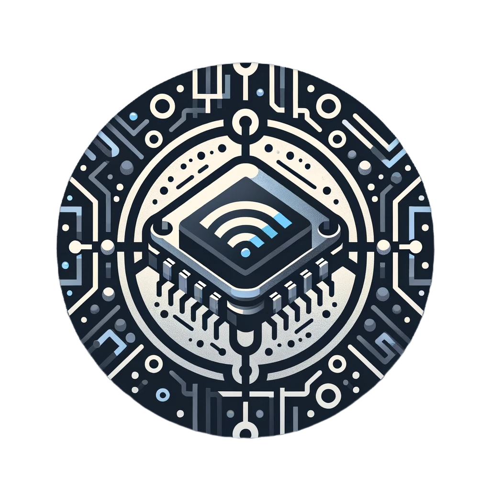

# PRODUCCIÓN DE UNA BLOCKCHAIN DE BITCOIN CON MICROCONTROLADORES ESP8266 A MENOR ESCALA (MicroBlockchain)

MicroBlockchain es un proyecto educativo que simula una blockchain basada en los principios fundamentales de Bitcoin, pero a una escala mucho menor. Este proyecto permite a los microcontroladores ESP8266 resolver la prueba de trabajo, ofreciendo una experiencia práctica y didáctica sobre el funcionamiento de la tecnología blockchain.

---

## Contenidos
- [Instalación](#instalación)
- [Cómo empezar](#cómo-empezar)
- [API y Rutas](#api-y-rutas)
- [Contribuciones](#contribuciones)
- [Comunidad y Soporte](#comunidad-y-soporte)
- [Licencia](#licencia)
- [Créditos](#créditos)

---

## Instalación

### Requisitos previos
- Python 3.x
- Flask
- Microcontroladores ESP8266
- Dependencias especificadas en `requirements.txt`

### Pasos de instalación
1. Clonar el repositorio: `git clone URL_DEL_REPOSITORIO`
2. Instalar dependencias: `pip install -r requirements.txt`
3. Instrucciones adicionales si las hay

---

## Cómo empezar

### Configuración del servidor Blockchain
- Iniciar el servidor: `python archivo_servidor.py`
- El servidor gestionará la cadena de bloques y las transacciones

### Minería con ESP8266
- Configura las credenciales de WiFi en el código del ESP8266
- Sube el código a tu ESP8266
- El dispositivo empezará a minar automáticamente, interactuando con el servidor

---

## API y Rutas

Descripción de las principales rutas y métodos de la API del servidor, como:
- `GET /chain`: Obtiene la cadena de bloques actual
- `POST /transactions/new`: Añade una nueva transacción
- `POST /mine`: Realiza la minería de un nuevo bloque

---

## Contribuciones

Si estás interesado en contribuir al proyecto, tus aportes son bienvenidos.

1. Fork del proyecto
2. Crea tu rama de características (`git checkout -b feature/AmazingFeature`)
3. Commit tus cambios (`git commit -m 'Add some AmazingFeature'`)
4. Push a la rama (`git push origin feature/AmazingFeature`)
5. Abre un Pull Request

---

## Comunidad y Soporte

Únete a nuestra comunidad en [Discord](LINK_A_DISCORD) o [otra plataforma] para obtener soporte, discutir y compartir ideas sobre el proyecto.

---

## Licencia

Este proyecto se distribuye bajo la Licencia MIT. Consulta el archivo `LICENSE` para obtener más detalles.

---

## Créditos

- [Dilan Gonzalez](https://www.linkedin.com/in/digovil/)
- [Luz Moronta](LINK_PERFIL)
- A todos los que han contribuido a hacer de MicroBlockchain un proyecto mejor.

---

© 2023 [Dilan Gonzalez](https://github.com/Digovil) - MicroBlockchain Project
